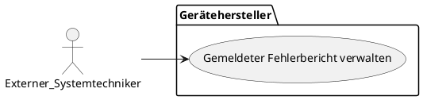
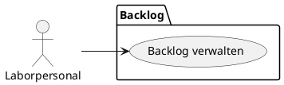
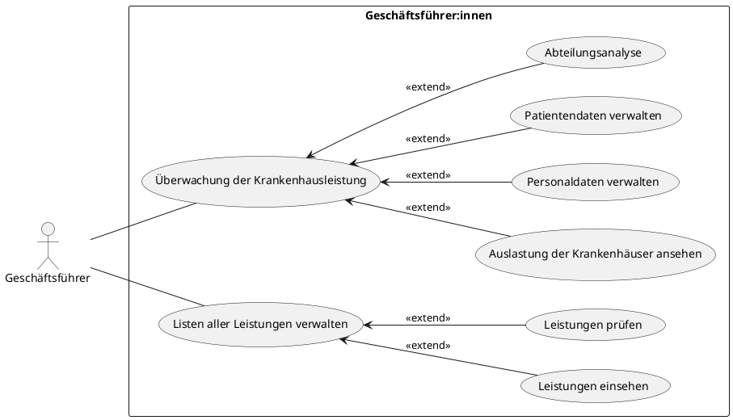
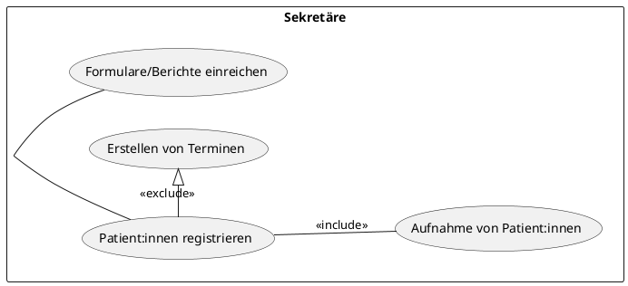
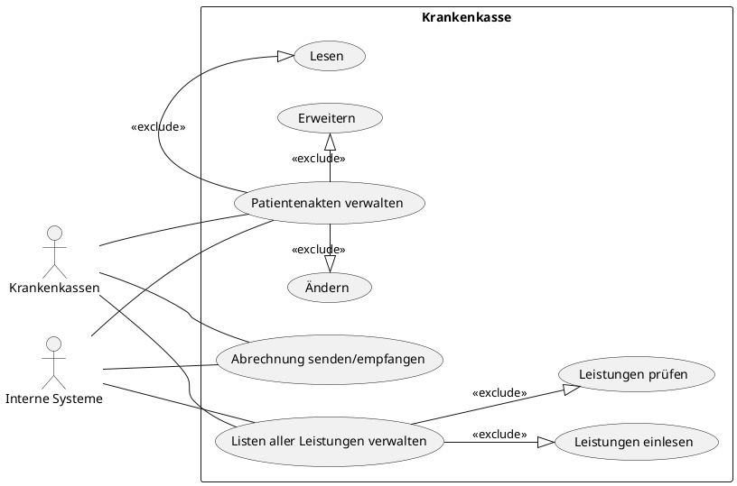

# Business Use Cases

**Interne & externe Ärzt:innen, Krankenpfleger:innen und Rettungskräfte - Antonia, Helen**

```plantuml BUC Interne & externe Ärzt:innen, Krankenpfleger:innen und Rettungskräfte --
left to right direction

actor "Krankenpfleger:innen" as nurse
actor "Interne Ärzt:innen" as int_docs
actor "Rettungskräfte" as rescue
actor "Externe Ärtz:innen" as ext_docs
actor "Patient:innen" as patients

package "BUC Patient:innen" {
  usecase "Arbeitsplan ansehen" as UC1
  usecase "Patientendaten pflegen" as UC2

  usecase "Übersichtliche Erste-Hilfe-Maßnahmen übergeben" as UC3
  usecase "Übergabe an Krankenhaus anmelden" as UC4

  usecase "Patientendaten anfordern" as UC5
}

nurse --> UC1
nurse --> UC2

int_docs --> UC1

rescue --> UC3
rescue --> UC4

ext_docs --> UC5
ext_docs --> UC2


package "BUC Transportdienst" {
  usecase "Patiententransportplan pflegen" as TUC1
  usecase "Routenplanung lesen" as TUC2
  usecase "Erinnerungen erhalten" as TUC3
  usecase "Termine pflegen" as TUC4
}

nurse --> TUC1
nurse --> TUC2
nurse --> TUC4
(TUC2) .> (TUC3) : extend

int_docs --> TUC4

patients --> TUC4
```

**Systemadministrator:innen - Jann Lucas Pischke**

```plantuml BUC für Systemadministrator:innen
left to right direction

actor "Systemadministrator:innen" as g

package "BUC Systemadministrator:innen" {
  (Systemüberwachung) as UC1
  (Benutzer verwalten) as UC2
  (Konfigurationsdaten verwalten) as UC3
  (Installation von Hardware) as UC4
  (Dokumentation verwalten) as UC5
}

g --> UC1
g --> UC2
g --> UC3
g --> UC4
g --> UC5
```

**Patient:innen - Jann Lucas Pischke** 

```plantuml BUC Patient:innen
left to right direction

actor "Patient:innen" as patient

package "BUC Patient:innen" {
  (Eigene Krankendaten einsehen) as UC1
  (Offene Leistungen einsehen) as UC2

  UC1 <-- (Geplante Arzt/Stationstermine einsehen): <<extend>>
  UC1 <-- (Kuratierte Diganose einsehen): <<extend>>
}

patient --> UC1
patient --> UC2
```

**Externe Systemtechniker - Lino Becht**



**Interne Systemtechniker:innen - Lino Becht**

```plantuml BUC Geraetehersteller
@startuml
left to right direction
actor Interner_Systemtechniker:innen as is
package Medizinisches_Gerät {
  usecase "Medizinisches Gerät verwalten" as UC1
}

is --> UC1
@enduml
```

**Backlog - Lino Becht**



**Geschäftsführer: innen - Duc Duong Nguyen**


**Sekretär:innen - Duc Duong Nguyen**



**Krankenkasse - Duc Duong Nguyen**



