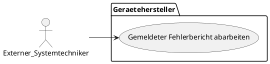
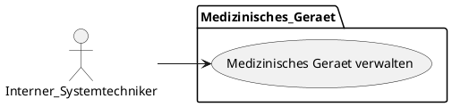
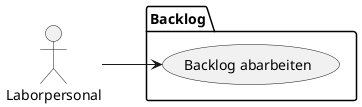

# Business Use Cases

**Interne & externe Ärzte, Krankenpfleger und Rettungskräfte - Antonia, Helen**

```plantuml BUC Interne & externe Ärzte, Krankenpfleger und Rettungskräfte --
left to right direction

actor "Krankenpfleger:innen" as nurse
actor "Interne Ärzt:innen" as int_docs
actor "Rettungskräfte" as rescue
actor "Externe Ärtz:innen" as ext_docs
actor "Patient:innen" as patients

package "BUC Patient:innen" {
  usecase "Arbeitsplan ansehen" as UC1
  usecase "Patientendaten pflegen" as UC2
  usecase "Patientendaten erweitern" as UC3
  usecase "Patient suchen" as UC4

  usecase "Patientendaten lesen" as UC5
  usecase "Patienten anlegen" as UC6
  usecase "Zusätzliche Daten erstellen" as UC7

  usecase "Übersichtliche Erste-Hilfe-Maßnahmen übergeben" as UC8
  usecase "Übergabe an Krankenhaus anmelden" as UC9

  usecase "Patientendaten anfordern" as UC10
  usecase "Patientendaten senden" as UC11
}

nurse --> UC1
nurse --> UC2

(UC3) .> (UC2) : extend
(UC4) .> (UC2) : extend
(UC5) .> (UC2) : extend

int_docs --> UC1
int_docs --> UC2
int_docs --> UC6
int_docs --> UC7

rescue --> UC8
rescue --> UC9

ext_docs --> UC10
ext_docs --> UC11


package "BUC Transportdienst" {
  usecase "Patiententransportplan pflegen" as TUC1
  usecase "Routenplanung lesen" as TUC2
  usecase "Erinnerungen erhalten" as TUC3
  usecase "Termine eintragen" as TUC4
  usecase "Termine pflegen (Absagen, verschieben, bestätigen)" as TUC5
  usecase "Terminübersicht einsehen" as TUC6
}

nurse --> TUC1
nurse --> TUC2
nurse --> TUC6
(TUC2) .> (TUC3) : extend

int_docs -->  TUC4
int_docs --> TUC5

patients --> TUC6
```

**Systemadministrator:innen - Jann Lucas Pischke**

```plantuml BUC für Systemadministrator:innen
left to right direction

actor "Systemadministrator:innen" as g

package "BUC Systemadministrator:innen" {
  usecase "Logdaten einsehen" as UC1
  usecase "Berechtigungen verwalten" as UC2
  usecase "Konfigurationsdaten. verwalten" as UC3
  usecase "Hardwaredaten einsehen" as UC4
  usecase "Datenbanklogs einsehen" as UC5
}

g --> UC1
g --> UC2
g --> UC3

(UC4) .> (UC1) : extend
(UC5) .> (UC1) : extend
```

**Patient:innen - Jann Lucas Pischke** 

```plantuml BUC Patient:innen
left to right direction

actor "Patient:innen" as patient

package "BUC Patient:innen" {
  usecase "Eigene Krankendaten einsehen" as UC1
  usecase "Offene Leistungen einsehen" as UC2
  usecase "Geplante Arzt/Stationstermine einsehen" as UC3
  usecase "kuratierte Diganose einsehen" as UC4
}

patient --> UC1
patient --> UC2

(UC3) .> (UC1) : extend
(UC4) .> (UC1) : extend
```

**Sekretär:innen**

```plantuml BUC Sekretär:innen
left to right direction

actor "Sekretär:innen" as secretary

package "BUC Patient:innen" {
  usecase "Formular/Berichte einreichen" as UC1
  usecase "Erstellen von Terminen" as UC2
  usecase "Patienten registrieren" as UC3
  usecase "Aufnahme von Patienten" as UC4
  usecase "Erstellen einer Patientennummer" as UC5

  usecase "Aufnahme in normale Klinik" as UC6
  usecase "Aufnahme in spezielle Klinik" as UC7
  usecase "Verwaltung der Betten/Zimmer" as UC8
}

secretary --> UC1
secretary --> UC2
secretary --> UC3
secretary --> UC4
secretary --> UC5

(UC4) -- (UC6)
(UC4) -- (UC7)
(UC6) <. (UC8) : include
(UC7) <. (UC8) : include
```

**Geschäftsführer**

```plantuml BUC Geschäftsführer
left to right direction

actor "Geschäftsführer" as ceo

package "BUC Geschäftsführer" {
  usecase "Listen aller Leistungen verwalten" as UC1
  usecase "Übersicht über die Krankenhäuser ansehen" as UC2

  usecase "Leistungen einsehen" as UC3
  usecase "Leistungen prüfen" as UC4

  usecase "Auslastung der Krankenhäuser ansehen" as UC5
  usecase "Personaldaten verwalten" as UC6
  usecase "Patientendaten verwalten" as UC7
  usecase "Abteilungsanalyse" as UC8
}

ceo --> UC1
ceo --> UC2

(UC1) -- (UC3)
(UC1) -- (UC4)

(UC2) -- (UC5)
(UC2) -- (UC6)
(UC2) -- (UC7)
(UC2) -- (UC8)
```

**Krankenkasse**

```plantuml BUC Krankenkasse
left to right direction

actor "Krankenkasse" as insurance
actor "Interne Systeme" as systems

package "BUC Geschäftsführer" {
  usecase "Datenaustausch (Schnittstelle)" as UC1

  usecase "Patientenakten verwalten" as UC2
  usecase "Abrechnung senden/empfangen" as UC3
  usecase "Listen aller Leistungen verwalten" as UC4

  usecase "lesen" as UC5
  usecase "erweitern" as UC6
  usecase "ändern" as UC7

  usecase "Leistungen einsehen" as UC8
  usecase "Leistungen prüfen" as UC9
}

systems --> UC1
insurance --> UC2

(UC1) -- (UC2)
(UC1) -- (UC3)
(UC1) -- (UC4)

(UC2) -- (UC5)
(UC2) -- (UC6)
(UC2) -- (UC7)

(UC4) -- (UC8)
(UC4) -- (UC9)
```

**Externe Systemtechniker**



**Interne Systemtechniker**



**Backlog**


