# System Use Cases

**Patientendaten pflegen - Antonia**

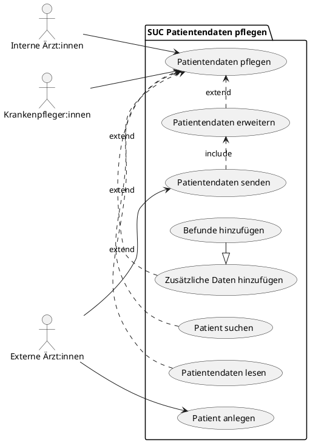


**Termine pflegen - Antonia**

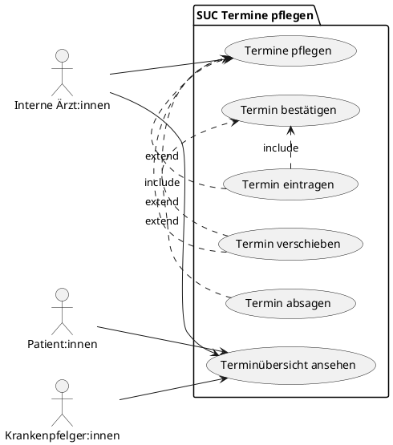


**Gemeldeter Fehlerbericht verwalten - Lino Becht**

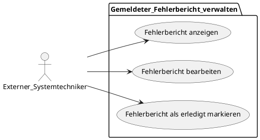


**Medizinisches Geraet verwalten - Lino Becht**

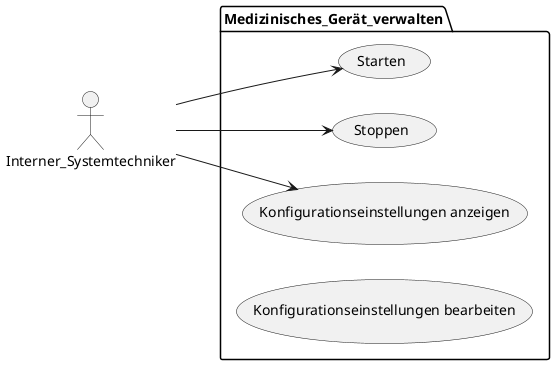

**Backlog verwalten - Lino Becht**

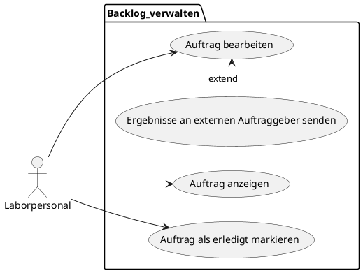

**Routenplanung - Helen**

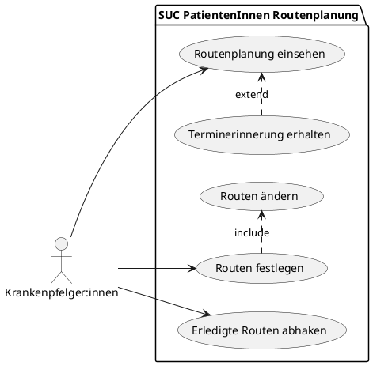

**Benutzerverwaltung - Jann**

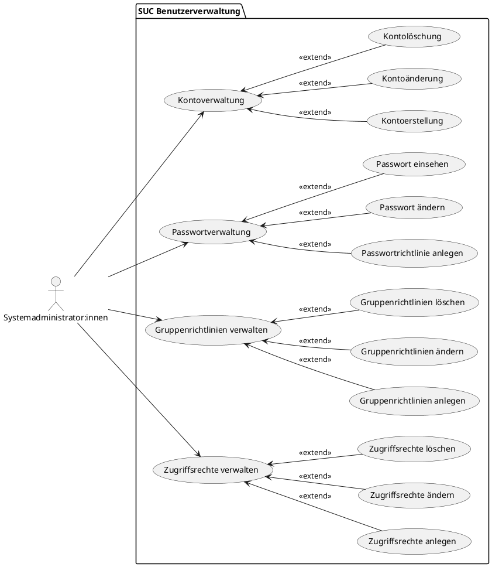

**Systemüberwachung - Jann**

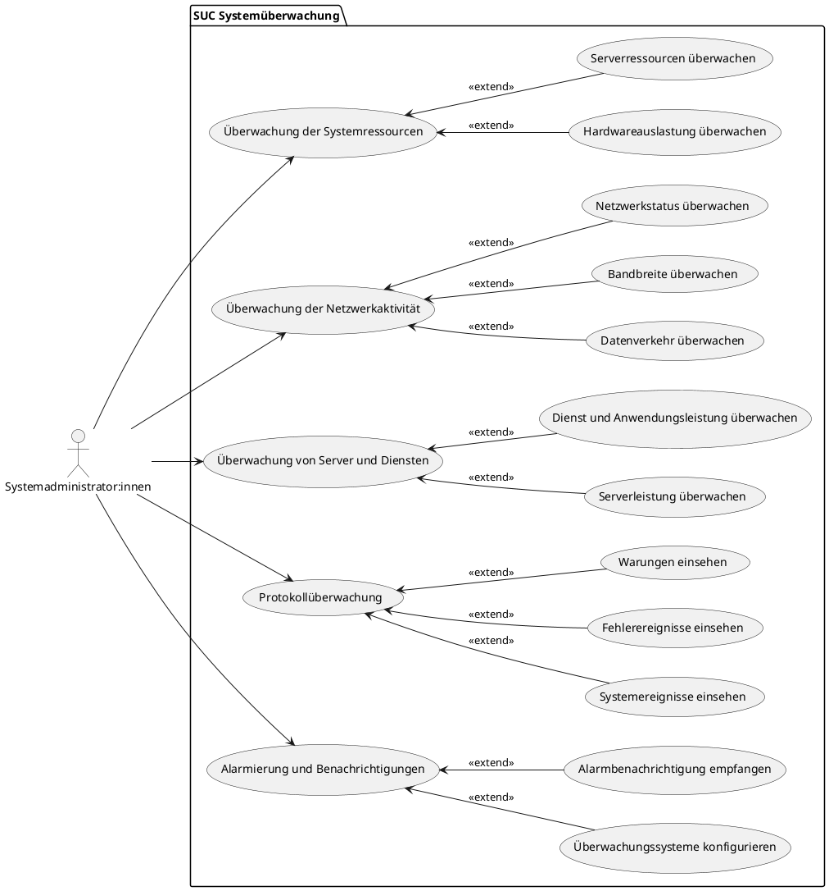

**Konfigurationsdaten verwalten - Jann**
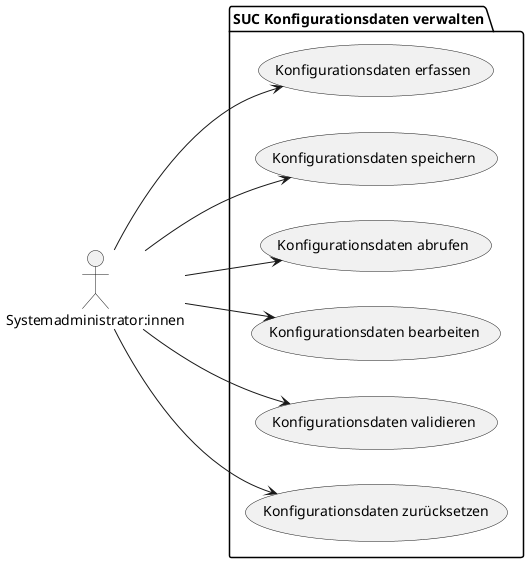

**Installation von Hardware - Jann**
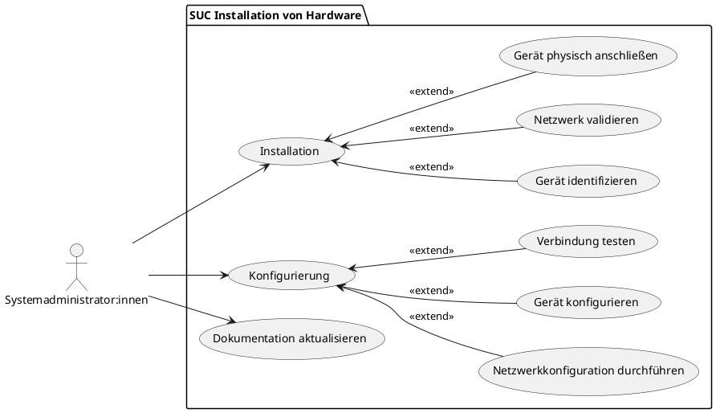

**Dokumentation verwalten - Jann**

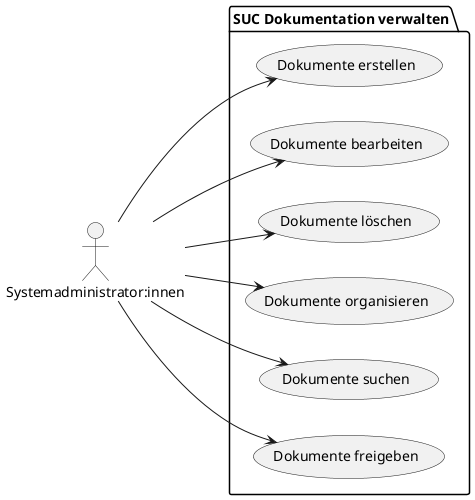

**Krankendaten einsehen - Jann**

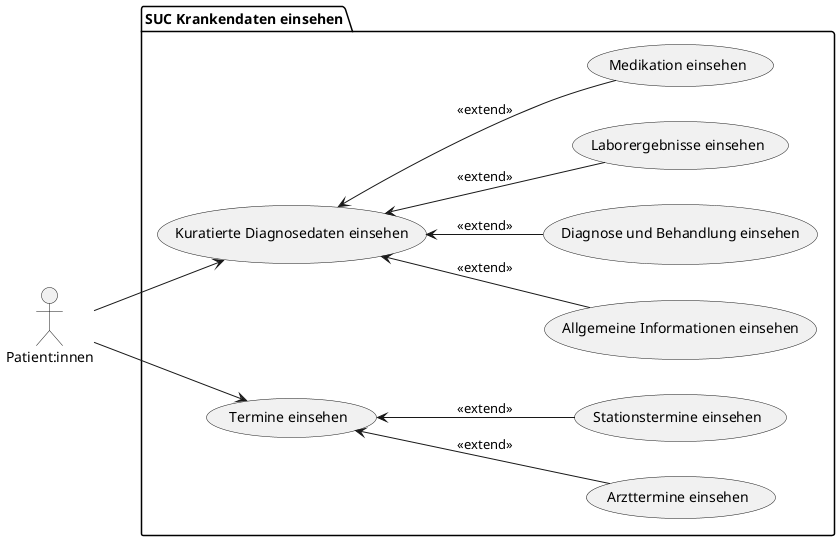

**Offene Leistungen einsehen - Jann**

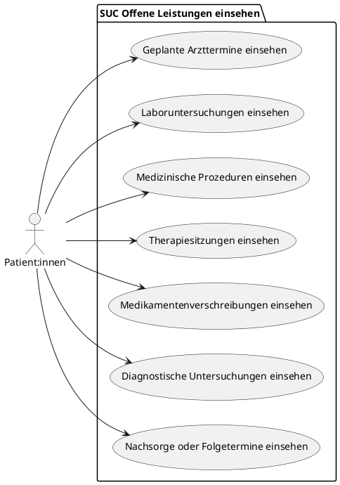

**Patientendaten verwalten - Duc Duong Nguyen**
```plantuml Patientendaten verwalten
@startuml
left to right direction
actor Geschäftsführer:innen as GF
actor Krankenkasse as K

rectangle "Patientendaten verwalten" {

usecase UC1 as "Patientenakten einsehen"
usecase UC2 as "Patientenstatistiken überprüfen"
usecase UC3 as "Patientendaten aktualisieren"
usecase UC4 as "Patientendaten versenden"
usecase UC5 as "Patientendaten empfangen"

GF -- UC1
GF -- UC2
GF -- UC3
GF -- UC4
GF -- UC5

K -- UC4
K -- UC5

note right of UC1: Geschäftsführer:innen kann auf die\nAkten von Patient:innen zugreifen, um Daten\nfür Berichte oder Analysen zu sammeln.
note right of UC2: Geschäftsführer:innen kann Statistiken überprüfen,\ndie die Anzahl der Patient:innen, die Länge des\nKrankenhausaufenthalts, ...
note right of UC3: Geschäftsführer:innen kann bestimmte Informationen\n zu Patientendaten aktualisieren(ändern, löschen),\nz. B. Kontaktdaten oder Versicherungsinformationen.
note right of UC4: Geschäftsführer:innen und die Krankenkasse kann \n Patientendatenversenden, beispielsweise an \n anderen/externe Einrichtungen oder andere \n Abteilungen innerhalb des Krankenhauses.
note right of UC5: Geschäftsführer:innen und die Krankenkasse kann \n Patientendaten empfangen, zum Beispiel von \n anderen/externe Einrichtungen, die Patienten \n an das Krankenhaus überweisen, oder von den \n Abteilungen innerhalb des Krankenhauses selbst.
@enduml
```

**Leistungsübersicht - Duc Duong Nguyen**
```plantuml Leistungsübersicht
@startuml
left to right direction

actor Geschäftsführer:innen as GF

rectangle "Leistungsübersicht" {

usecase "Personalperformance-Daten abrufen" as UC1
usecase "Abteilungsleistungs-Report einsehen" as UC2
usecase "Gerätenutzung prüfen" as UC3

GF -- UC1
GF -- UC2
GF -- UC3

note right of UC1: Geschäftsführer:innen sieht sich Personalperformance-Daten an, \n um einen Überblick über die Produktivität und Kompetenz des Personals zu erhalten.
note right of UC2: Geschäftsführer:innen liest Abteilungsleistungs-Reports, \n um Informationen über die Effizienz und Kosten jeder Abteilung zu erhalten.
note right of UC3: Geschäftsführer:innen lässt sich Gerätenutzungsdaten anzeigen, \n um den Auslastungsgrad und Wartungsbedarf der medizinischen Geräte zu überblicken.
@enduml
```


**Personaldaten verwalten - Duc Duong Nguyen**


**Patientenaufnahme - Duc Duong Nguyen**
```plantuml Patientenaufnahme
@startuml
left to right direction

actor Sekretär:innen as S
actor Geschäftsführer:innen as GF
rectangle "Patientenaufnahme" {

usecase "Patientendaten erfassen" as UC1
usecase "Patientenakte anlegen" as UC2
usecase "Termin anlegen" as UC3
usecase "Terminänderungen durchführen" as UC4
usecase "Wartenummer erstellen" as UC5
usecase "Kapazität der Kliniken überprüfen" as UC6

S --> UC1
S --> UC2
S --> UC3
S --> UC4
S --> UC5
S --> UC6

GF --> UC6

note right of UC1: Sekretär:innen erfasst die Daten von neuen Patienten\n und fügt sie in das Krankenhausinformationssystem ein.
note right of UC2: Sekretär:innen legt eine neue Patientenakte an,\n sobald ein neuer Patient ins Krankenhaus kommt.
note right of UC3: Sekretär:innen plant Termine für/mit Patienten,\n basierend auf der Verfügbarkeit des medizinischen Personals.
note right of UC4: Sekretär:innen führt Änderungen an bestehenden Terminen durch,\n basierend auf den Anforderungen von Patienten und medizinischem Personal.
note right of UC5: Sekretär:innen erstellt eine Wartenummer für jeden Patienten,\n der auf eine Konsultation oder Behandlung wartet.
note right of UC6: Sekretär:innen und der Geschäftsführer überprüfen die Kapazität der Kliniken,\n um sicherzustellen, dass die Kliniken nicht überfüllt sind.
}
@enduml
```
