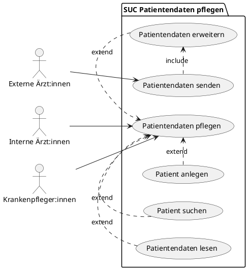
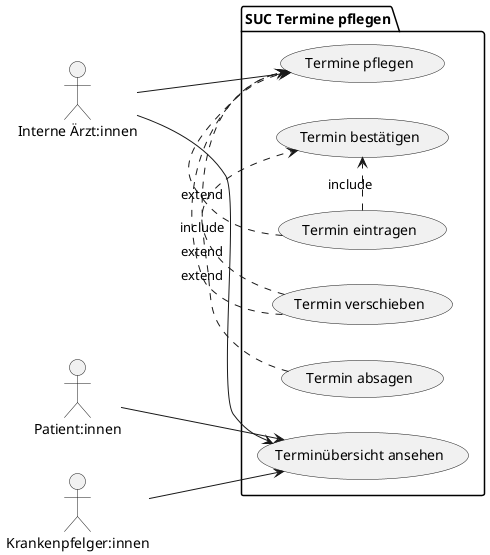
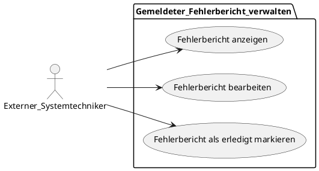
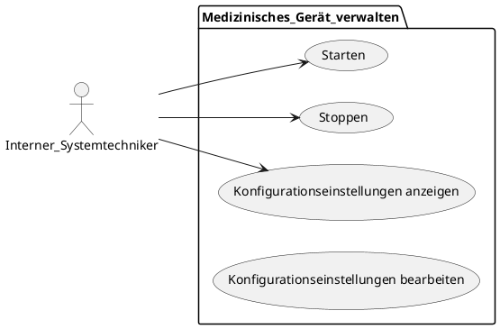
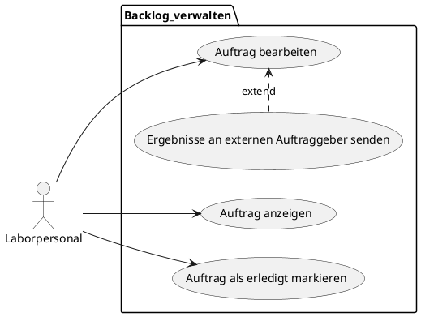
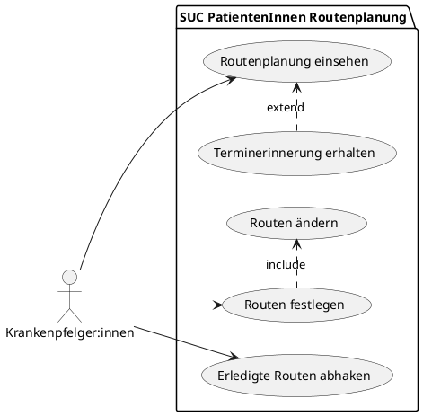
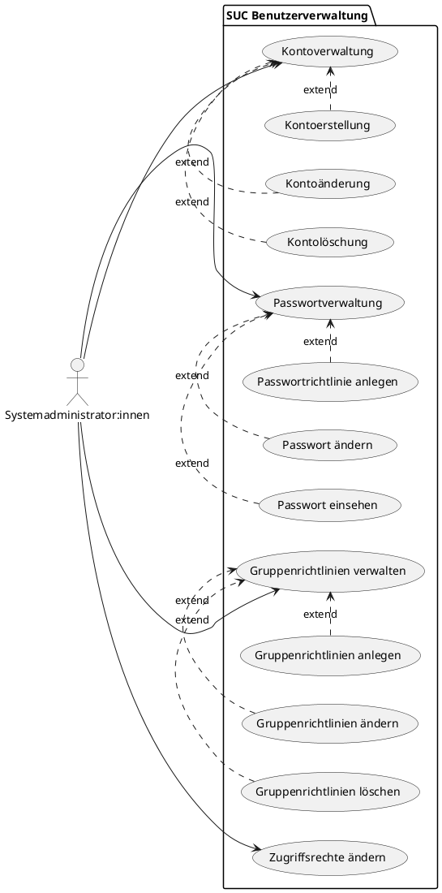
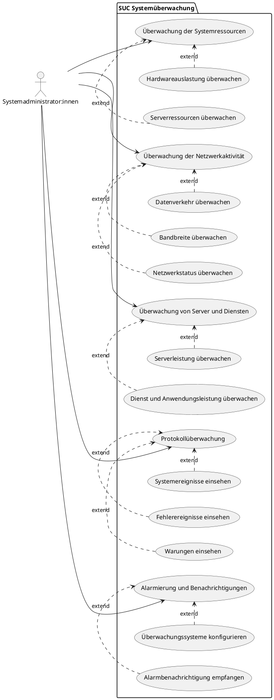

# System Use Cases

**Patientendaten pflegen - Antonia**

**Termine pflegen - Antonia**

**Gemeldeter Fehlerbericht verwalten - Lino Becht**

**Medizinisches Geraet verwalten - Lino Becht**

**Backlog verwalten - Lino Becht**

**Routenplanung - Helen**

**Benutzerverwaltung - Jann**

**Systemüberwachung - Jann**

