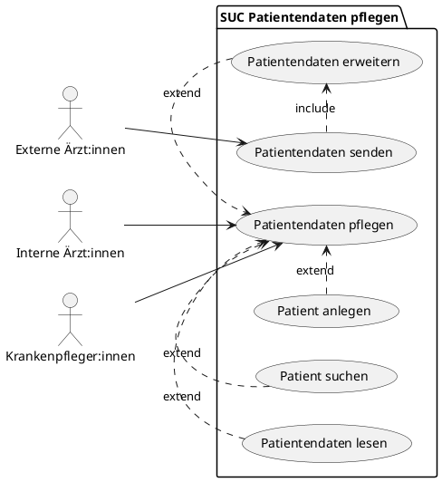
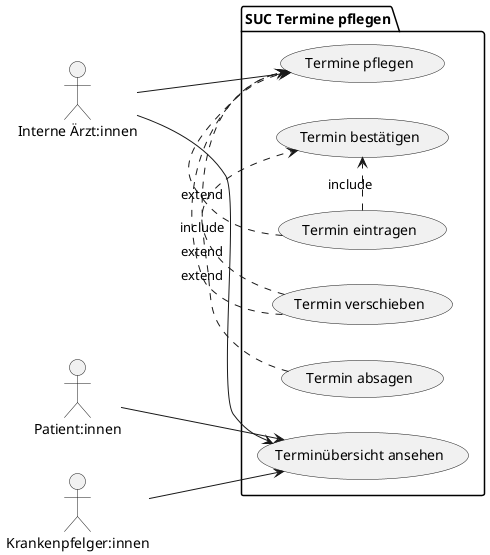

# System Use Cases

**Patientendaten pflegen - Antonia**

```plantuml Patientendaten pflegen
@startuml
left to right direction
actor "Interne Ärzt:innen" as int_docs
actor "Externe Ärzt:innen" as ext_docs
actor "Krankenpfleger:innen" as nurse


package "SUC Patientendaten pflegen" {
  usecase "Patientendaten pflegen" as UC1
  usecase "Patientendaten erweitern" as UC2
  usecase "Patient suchen" as UC3
  usecase "Patientendaten lesen" as UC4
  usecase "Patient anlegen" as UC5
  usecase "Patientendaten senden" as UC6
}

int_docs --> UC1
ext_docs --> UC6
nurse-->UC1

(UC2).>(UC1) : extend
(UC3).>(UC1) : extend
(UC4).>(UC1) : extend
(UC5).>(UC1) : extend

(UC6).>(UC2) : include
@enduml
```

**Termine pflegen - Antonia**

```plantuml Termine pflegen
@startuml
left to right direction
actor "Interne Ärzt:innen" as int_docs
actor "Patient:innen" as patient
actor "Krankenpfelger:innen" as nurse


package "SUC Termine pflegen" {
  usecase "Termine pflegen" as UC1
  usecase "Termin bestätigen" as UC2
  usecase "Termin eintragen" as UC3
  usecase "Termin verschieben" as UC4
  usecase "Termin absagen" as UC5
  usecase "Terminübersicht ansehen" as UC6
}

int_docs --> UC6
patient --> UC6
nurse --> UC6

int_docs --> UC1

(UC3).>(UC1) : extend 
(UC4).>(UC1) : extend
(UC5).>(UC1) : extend 

(UC3).>(UC2) : include
(UC4).>(UC2) : include
@enduml
```
