# Activity Diagrams

**Backlog bearbeiten - Lino Becht**

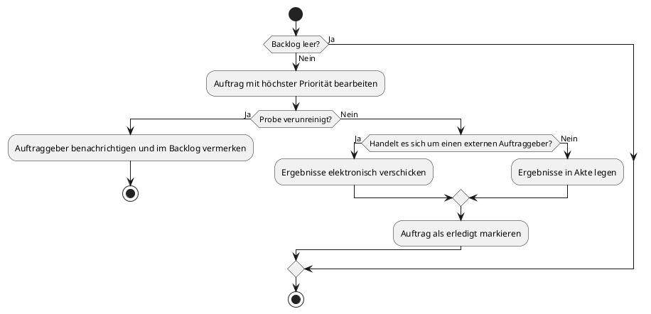

**Konfigurationseinstellungen bearbeiten - Lino Becht**

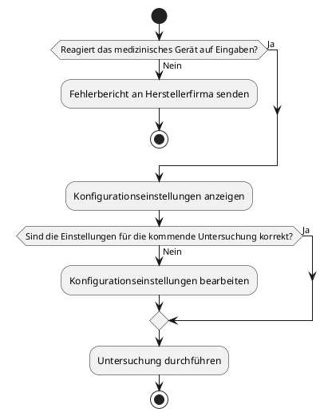

**Fehlerbericht bearbeiten - Lino Becht**

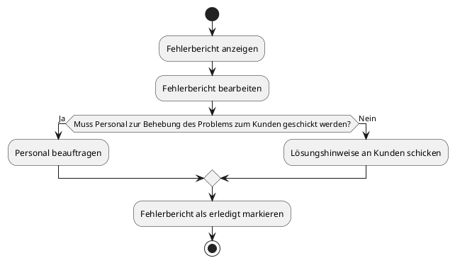

**Benutzerkontoerstellung - Jann**

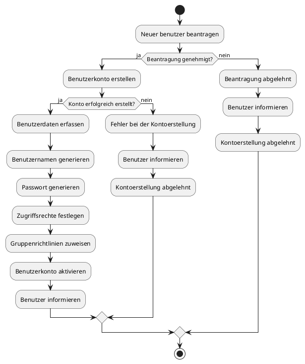

**Überwachung der Systemressourcen - Jann**

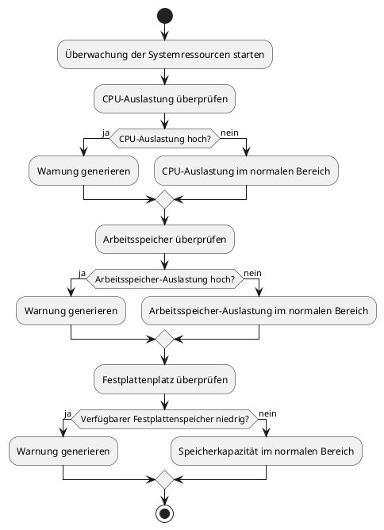

**Überwachung der Netzwerkaktivität - Jann**

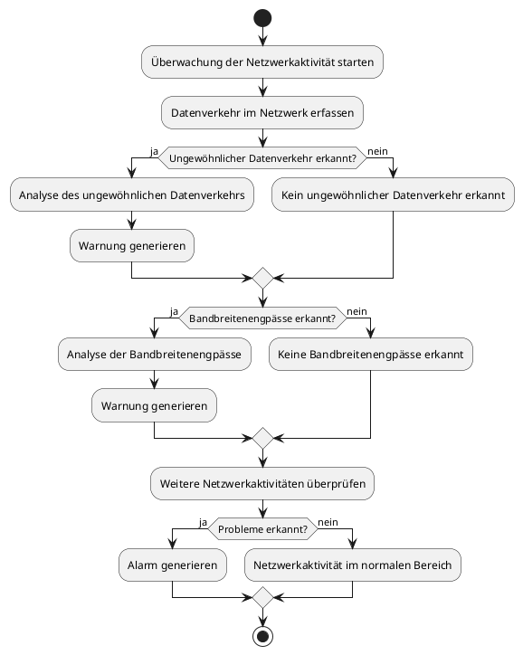

**Überwachung von Server und Diensten - Jann**

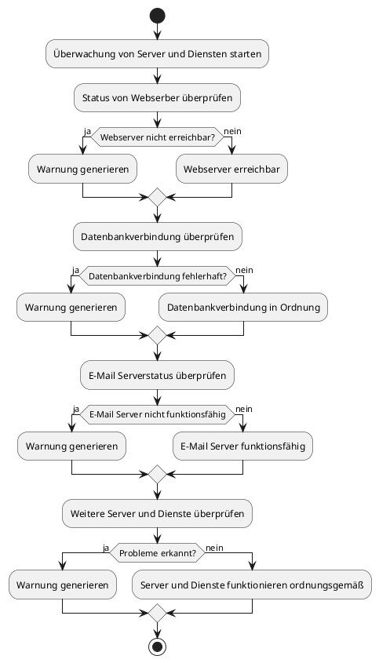

**Protokollüberwachung - Jann**

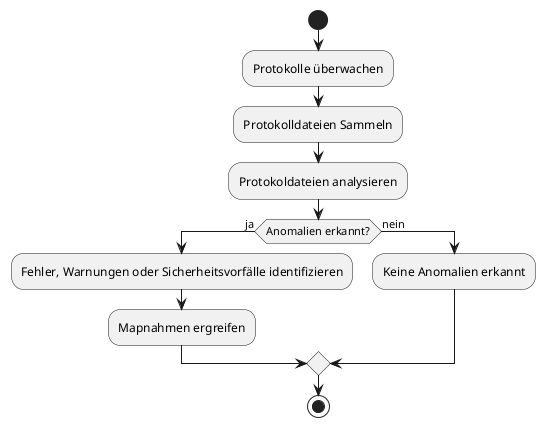

**Alarmierung und Benachrichtigungen - Jann**

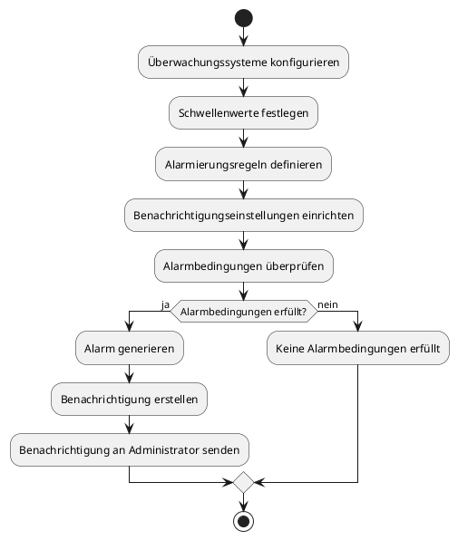

**Patientenaufnahme - Duc Duong Nguyen**

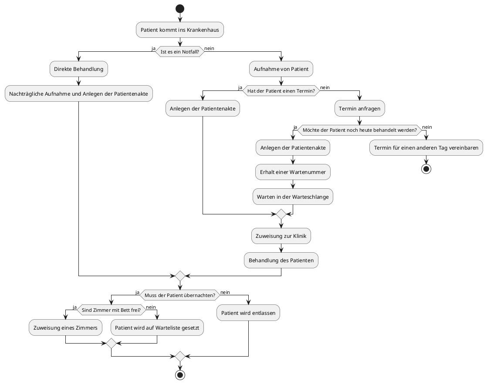

**Abteilungsanalyse - Duc Duong Nguyen**
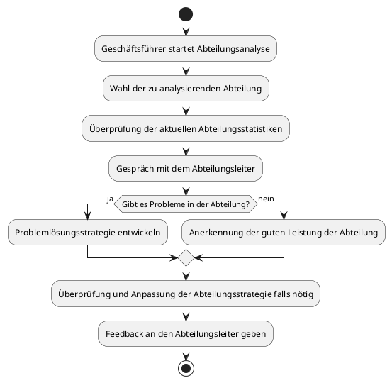

**Auslastung der Krankenhäuser ansehen - Duc Duong Nguyen**
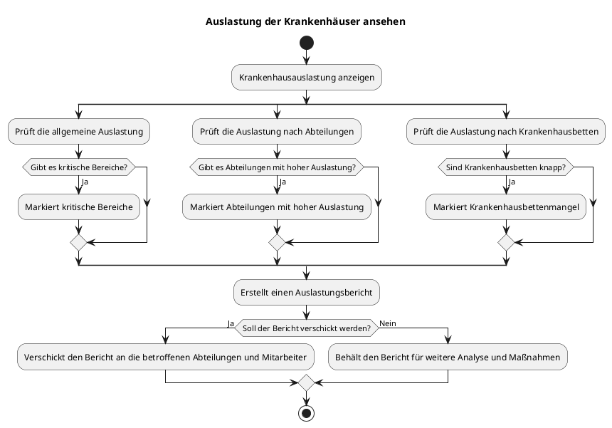

**Leistungsüberprüfung - Duc Duong Nguyen**
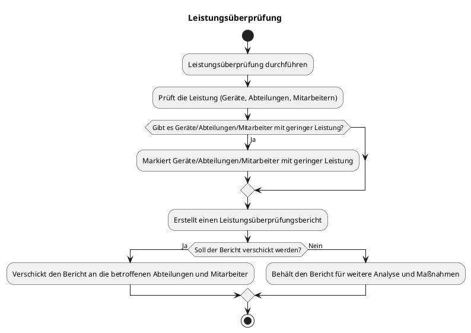

**Krankenkasse fordert Patientendaten - Duc Duong Nguyen**
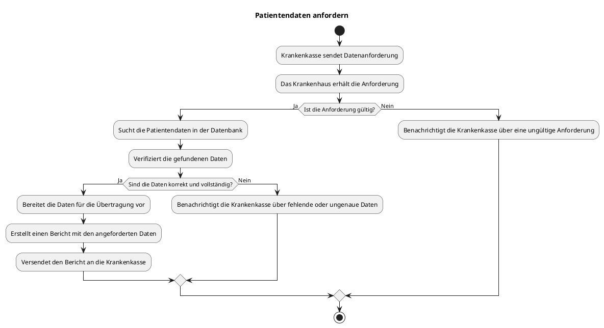

