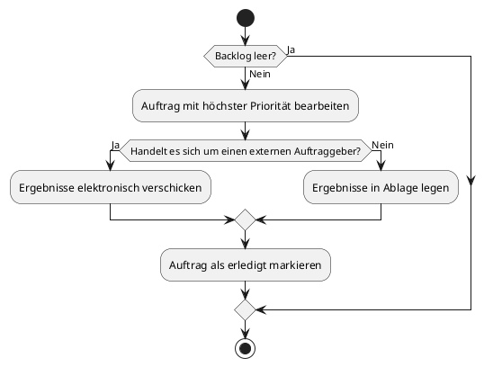
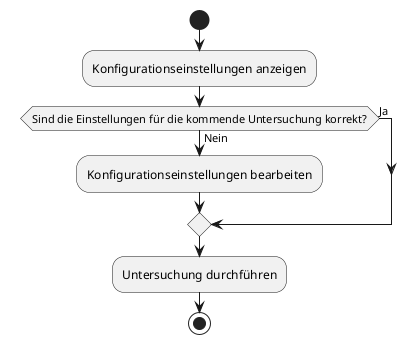
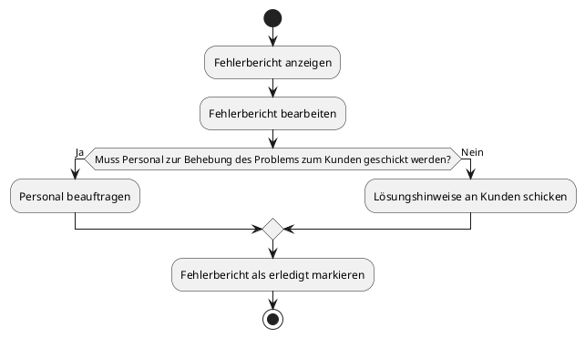

# Activity Diagrams

**Backlog bearbeiten - Lino Becht**

```plantuml Backlog bearbeiten
@startuml
start

if (Backlog leer?) then (Ja)
else (Nein)
  :Auftrag mit höchster Priorität bearbeiten;
  if (Handelt es sich um einen externen Auftraggeber?) then (Ja)
    :Ergebnisse elektronisch verschicken;
  else (Nein)
    :Ergebnisse in Ablage legen;
  endif
:Auftrag als erledigt markieren;
endif

stop
@enduml
```

**Konfigurationseinstellungen bearbeiten - Lino Becht**

```plantuml Konfigurationseinstellungen bearbeiten
@startuml
start

:Konfigurationseinstellungen anzeigen;
if (Sind die Einstellungen für die kommende Untersuchung korrekt?) then (Ja)
else (Nein)
:Konfigurationseinstellungen bearbeiten;
endif
:Untersuchung durchführen;

stop
@enduml
```

**Fehlerbericht bearbeiten - Lino Becht**

```plantuml Fehlerbericht bearbeiten
@startuml
start

:Fehlerbericht anzeigen;
:Fehlerbericht bearbeiten;
if (Muss Personal zur Behebung des Problems zum Kunden geschickt werden?) then (Ja)
  :Personal beauftragen;
else (Nein)
  :Lösungshinweise an Kunden schicken;
endif
:Fehlerbericht als erledigt markieren;

stop
@enduml
```
