# Activity Diagrams

**Backlog bearbeiten - Lino Becht**

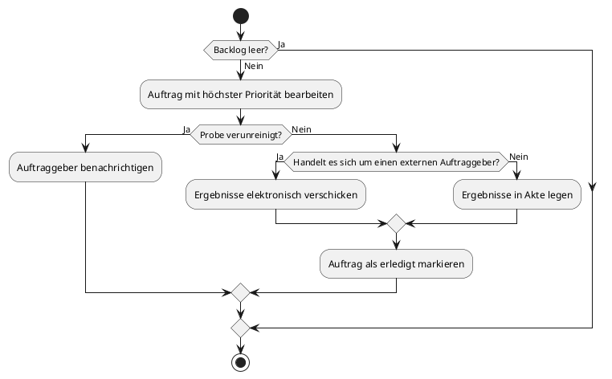

**Konfigurationseinstellungen bearbeiten - Lino Becht**

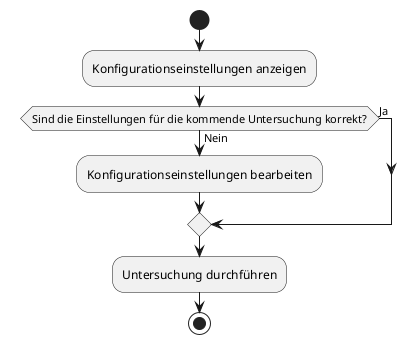

**Fehlerbericht bearbeiten - Lino Becht**

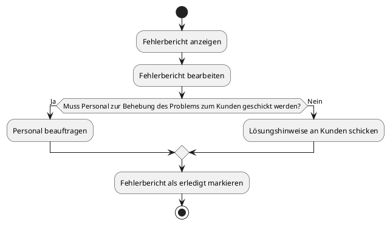

**Benutzerkontoerstellung - Jann**

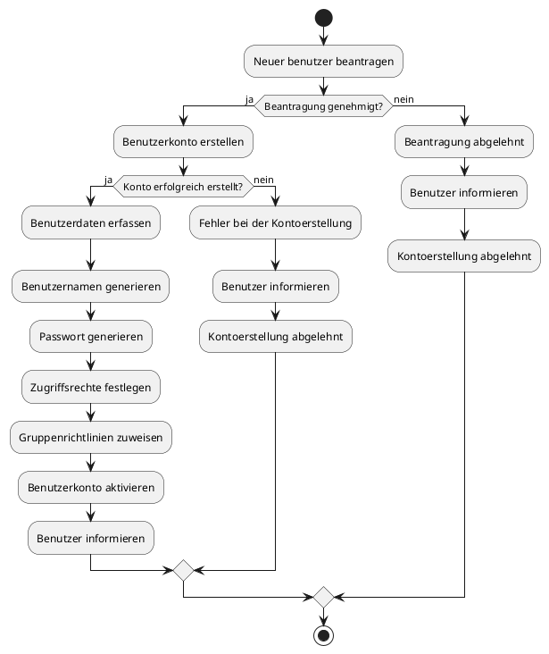

**Überwachung der Systemressourcen - Jann**

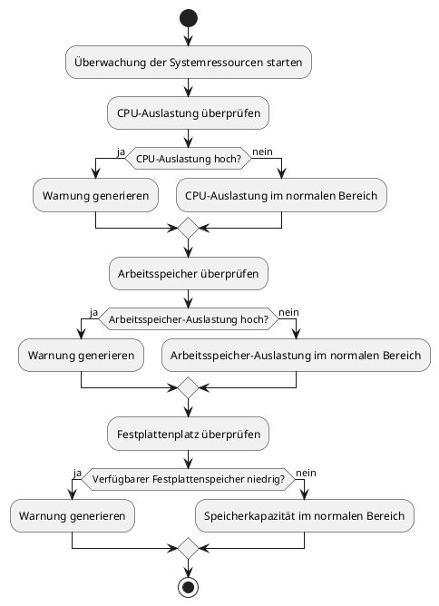

**Überwachung der Netzwerkaktivität - Jann**

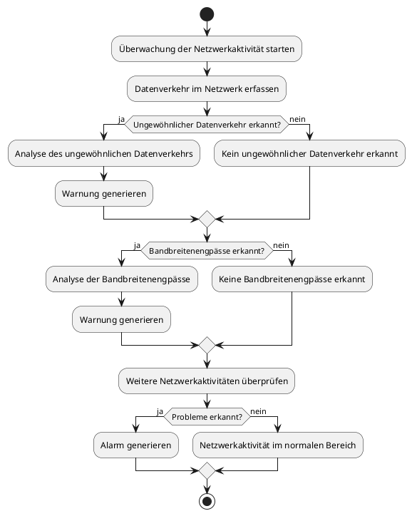

**Überwachung von Server und Diensten - Jann**

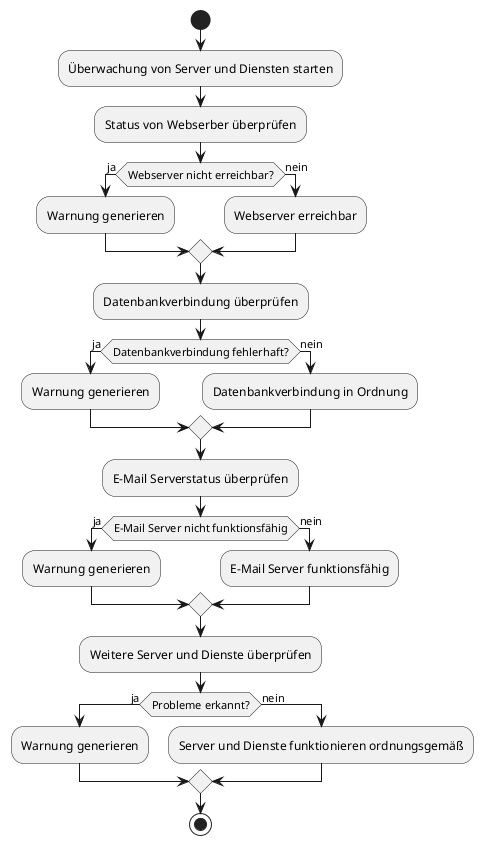

**Protokollüberwachung - Jann**

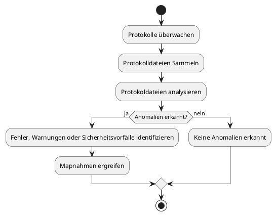

**Alarmierung und Benachrichtigungen - Jann**

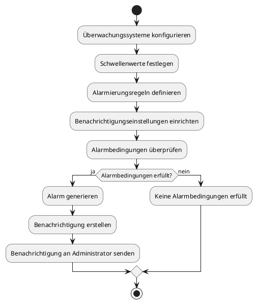

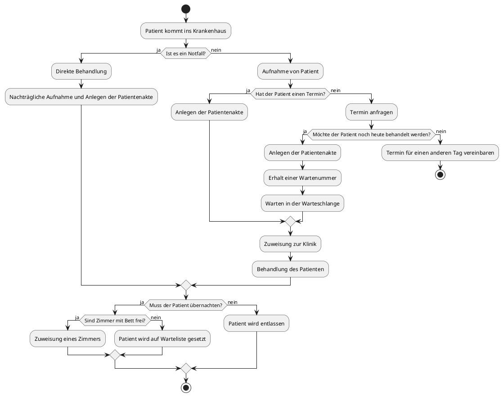

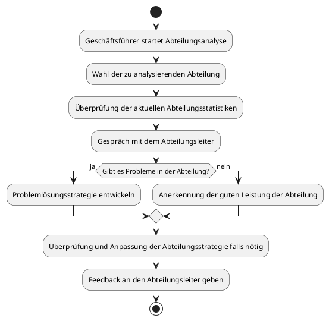
