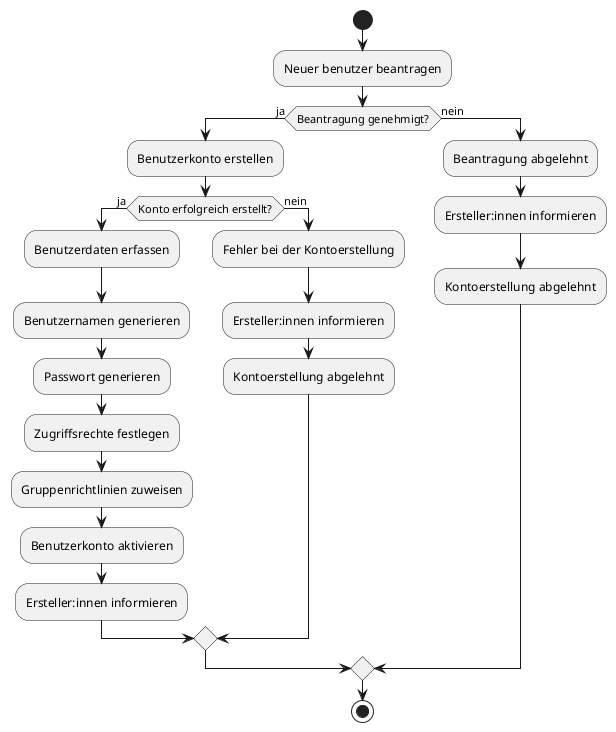
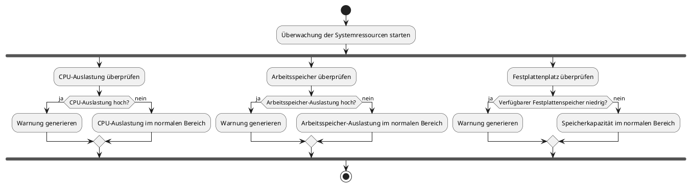
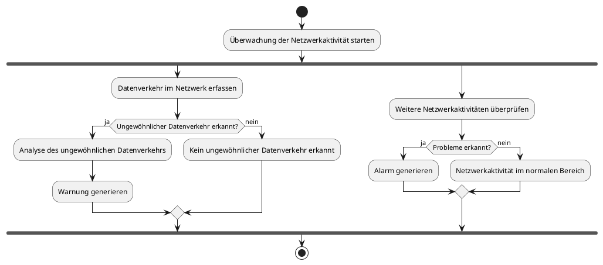
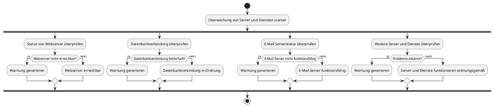
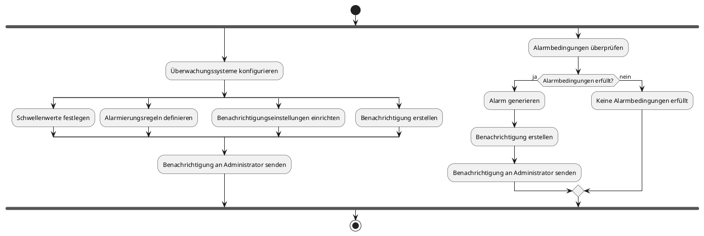
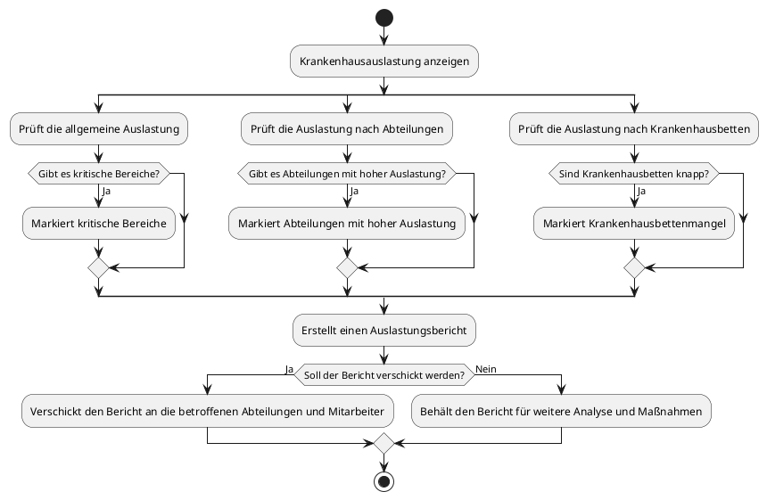
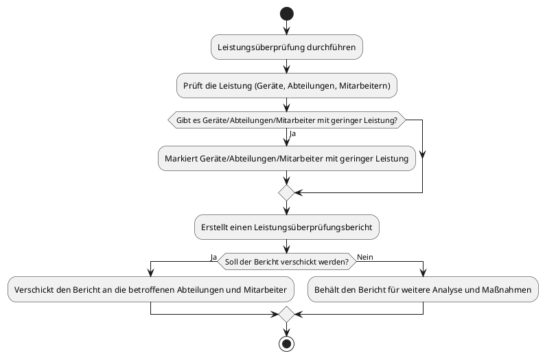
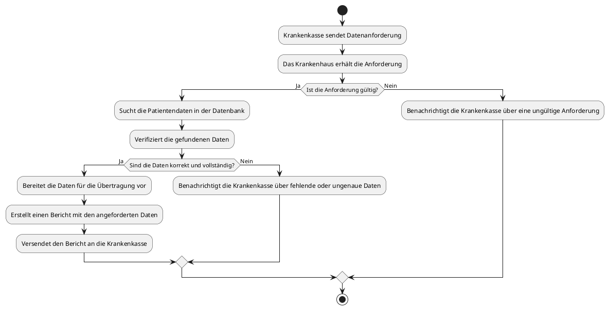

# Activity Diagrams

**Backlog bearbeiten - Lino Becht**


**Konfigurationseinstellungen bearbeiten - Lino Becht**


**Fehlerbericht bearbeiten - Lino Becht**


**Benutzerkontoerstellung - Jann**



**Überwachung der Systemressourcen - Jann**



**Überwachung der Netzwerkaktivität - Jann**



**Überwachung von Server und Diensten - Jann**



**Protokollüberwachung - Jann**


**Alarmierung und Benachrichtigungen - Jann**



**Dokumentation verwalten - Jann**
```
@startuml Dokumentation verwalten
start

fork
  :Dokumente erstellen;
  split
    :Dokumententyp auswählen;
    :Dokumenteninhalte erfassen;
    :Metadaten hinzufügen;
  end split
fork again
  :Dokumente bearbeiten;
  split
    :Dokument auswählen;
    :Änderungen vornehmen;
    :Änderungen speichern;
  end split
fork again
  :Dokumente löschen;
  split
    :Dokument auswählen;
    :Bestätigung für das Löschen erhalten;
    :Dokument löschen;
  end split
fork again
  :Dokumente organisieren;
  split
    :Dokumente in Kategorien/Ordner sortieren;
    :Metadaten aktualisieren;
  end split
fork again
  :Dokumente suchen;
  split
    :Suchkriterien festlegen;
    :Dokumente nach Kriterien durchsuchen;
    :Suchergebnisse anzeigen;
  end split
fork again
  :Dokumente freigeben;
  split
    :Dokument auswählen;
    :Freigabeberechtigungen festlegen;
    :Freigabe bestätigen;
  end split
end fork

stop
@enduml
```

**Krankendaten einsehen - Jann**
```
@startuml Krankendaten einsehen
start

fork
  :Kuratierte Diagnosedaten einsehen;
  split
    :Allgemeine Informationen einsehen;
  split again  
    :Diagnose und Behandlung einsehen;
  split again  
    :Laborergebnisse einsehen;
  split again
    :Medikation einsehen;
  end split
fork again
    :Termine einsehen;
  split  
    :Arzttermine einsehen; 
  split again
    :Stationstermine einsehen;
  end split
end fork

stop
@enduml

```

**Offene Leistungen einsehen - Jann**
```
@startuml
start

:Offene Leistungen einsehen;
fork
  if (Geplante Arzttermine einsehen?) then (ja)
    :Geplante Arzttermine anzeigen;
  else (nein)
    :Keine geplanten Arzttermine;
  endif
fork again
  if (Laboruntersuchungen einsehen?) then (ja)
    :Laboruntersuchungen anzeigen;
  else (nein)
    :Keine Laboruntersuchungen;
  endif
fork again
  if (Medizinische Prozeduren einsehen?) then (ja)
    :Medizinische Prozeduren anzeigen;
  else (nein)
    :Keine medizinischen Prozeduren;
  endif
fork again
  if (Therapiesitzungen einsehen?) then (ja)
    :Therapiesitzungen anzeigen;
  else (nein)
    :Keine Therapiesitzungen;
  endif
fork again
  if (Medikamentenverschreibungen einsehen?) then (ja)
    :Medikamentenverschreibungen anzeigen;
  else (nein)
    :Keine Medikamentenverschreibungen;
  endif
fork again
  if (Diagnostische Untersuchungen einsehen?) then (ja)
    :Diagnostische Untersuchungen anzeigen;
  else (nein)
    :Keine diagnostischen Untersuchungen;
  endif
fork again
  if (Nachsorge oder Folgetermine einsehen?) then (ja)
    :Nachsorge oder Folgetermine anzeigen;
  else (nein)
    :Keine Nachsorge oder Folgetermine;
  endif
end fork
stop
@enduml
```


**Patientenaufnahme - Duc Duong Nguyen**


**Abteilungsanalyse - Duc Duong Nguyen**


**Auslastung der Krankenhäuser ansehen - Duc Duong Nguyen**


**Leistungsüberprüfung - Duc Duong Nguyen**


**Krankenkasse fordert Patientendaten - Duc Duong Nguyen**



