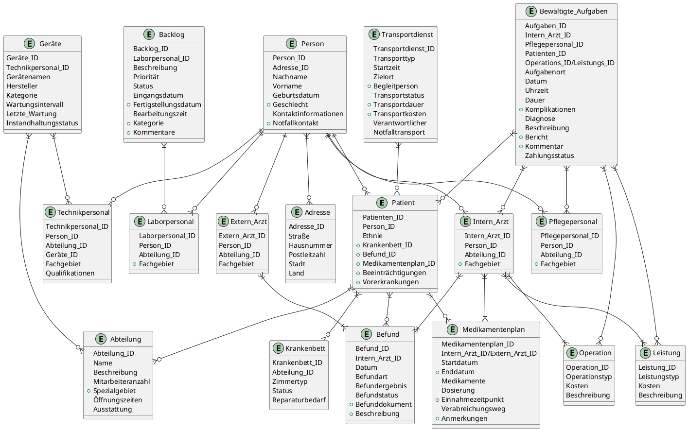

# ER-diagram

**PlantUML relationship legend**

```plantuml Legend
@startuml

| Art              |  Symbol  |
---------------------------------
| Eine oder Keine  |   |o--   |
| Exakt Eine 	   |   ||--   | 
| Keine oder Viele |   }o--   |
| Eine oder Viele  |   }|--   |
---------------------------------

@enduml
```

**First version of our ER-diagram**


