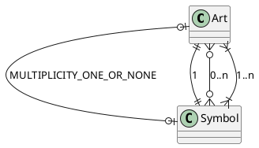
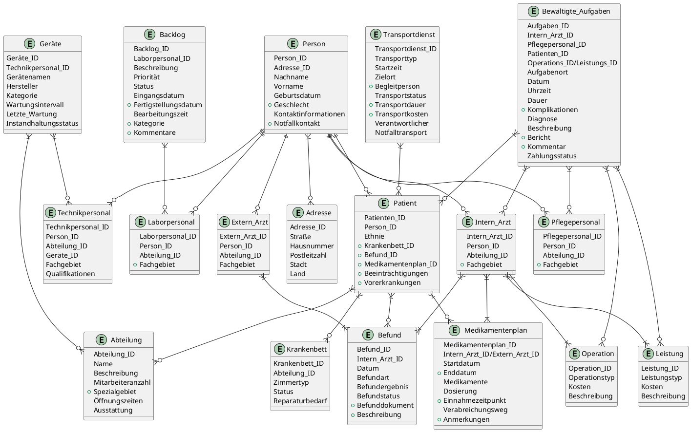
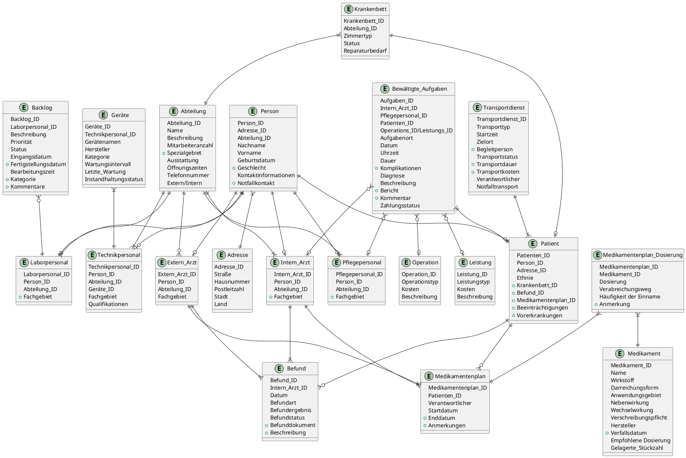

# ER-diagram

**PlantUML relationship legend**

```plantuml Legend
@startuml

!define MULTIPLICITY_ONE_OR_MANY  "1 or many"
!define MULTIPLICITY_EXACTLY_ONE  "1"
!define MULTIPLICITY_ZERO_OR_MANY "0..n"
!define MULTIPLICITY_ONE_OR_MANY  "1..n"

class Art {
}

class Symbol {
}

Art |o--o| Symbol : MULTIPLICITY_ONE_OR_NONE
Art ||--|| Symbol : MULTIPLICITY_EXACTLY_ONE
Art }o--o{ Symbol : MULTIPLICITY_ZERO_OR_MANY
Art }|--|{ Symbol : MULTIPLICITY_ONE_OR_MANY

@enduml
```

**First version of our ER-diagram**

```plantuml ER-diagram
@startuml
entity "Patient" as patient {
    Patienten_ID
    Person_ID
    Ethnie
  + Krankenbett_ID
  + Befund_ID
  + Medikamentenplan_ID
  + Beeinträchtigungen
  + Vorerkrankungen
}

entity "Person" as person {
    Person_ID
    Adresse_ID
    Nachname
    Vorname
    Geburtsdatum
  + Geschlecht
    Kontaktinformationen
  + Notfallkontakt
}

entity "Intern_Arzt" as intern_arzt {
    Intern_Arzt_ID
    Person_ID
    Abteilung_ID
  + Fachgebiet
}

entity "Extern_Arzt" as extern_arzt {
    Extern_Arzt_ID
    Person_ID
    Abteilung_ID
    Fachgebiet
}

entity "Technikpersonal" as technikpersonal {
    Technikpersonal_ID
    Person_ID
    Abteilung_ID
    Geräte_ID
    Fachgebiet
    Qualifikationen
}

entity "Laborpersonal" as laborpersonal {
    Laborpersonal_ID
    Person_ID
    Abteilung_ID
  + Fachgebiet
}

entity "Pflegepersonal" as pflegepersonal {
    Pflegepersonal_ID
    Person_ID
    Abteilung_ID
  + Fachgebiet
}

entity "Transportdienst" as transportdienst {
    Transportdienst_ID
    Transporttyp
    Startzeit
    Zielort
  + Begleitperson
    Transportstatus
  + Transportdauer
  + Transportkosten
    Verantwortlicher
    Notfalltransport
}

entity "Adresse" as adresse {
    Adresse_ID
    Straße
    Hausnummer
    Postleitzahl
    Stadt
    Land
}

entity "Krankenbett" as krankenbett {
    Krankenbett_ID
    Abteilung_ID
    Zimmertyp
    Status
    Reparaturbedarf
}

entity "Abteilung" as abteilung {
    Abteilung_ID
    Name
    Beschreibung
    Mitarbeiteranzahl
  + Spezialgebiet
    Öffnungszeiten
    Ausstattung
}

entity "Backlog" as backlog {
    Backlog_ID
    Laborpersonal_ID
    Beschreibung
    Priorität
    Status
    Eingangsdatum
  + Fertigstellungsdatum
    Bearbeitungszeit
  + Kategorie
  + Kommentare
}

entity "Bewältigte_Aufgaben" as bewaeltigte_aufgaben {
    Aufgaben_ID
    Intern_Arzt_ID
    Pflegepersonal_ID
    Patienten_ID
    Operations_ID/Leistungs_ID
    Aufgabenort
    Datum
    Uhrzeit
    Dauer
  + Komplikationen
    Diagnose
    Beschreibung
  + Bericht
  + Kommentar
    Zahlungsstatus
}

entity "Operation" as operation {
    Operation_ID
    Operationstyp
    Kosten
    Beschreibung
}

entity "Leistung" as leistung {
    Leistung_ID
    Leistungstyp
    Kosten
    Beschreibung
}

entity "Medikamentenplan" as medikamentenplan {
    Medikamentenplan_ID
    Intern_Arzt_ID/Extern_Arzt_ID
    Startdatum
  + Enddatum
    Medikamente
    Dosierung
  + Einnahmezeitpunkt
    Verabreichungsweg
  + Anmerkungen
}

entity "Geräte" as geraete {
    Geräte_ID
    Technikpersonal_ID
    Gerätenamen
    Hersteller
    Kategorie
    Wartungsintervall
    Letzte_Wartung
    Instandhaltungsstatus
}

entity "Befund" as befund {
    Befund_ID
    Intern_Arzt_ID
    Datum
    Befundart
    Befundergebnis
    Befundstatus
  + Befunddokument
  + Beschreibung
}

person ||--o{ patient
person ||--o{ intern_arzt
person ||--o{ extern_arzt
person ||--o{ technikpersonal
person ||--o{ laborpersonal
person ||--o{ pflegepersonal
person }|--o{ adresse

patient }|--o{ abteilung
patient }|--o{ krankenbett
patient }|--o{ medikamentenplan
patient }|--o{ befund

bewaeltigte_aufgaben }|--o{ intern_arzt
bewaeltigte_aufgaben }|--o{ pflegepersonal
bewaeltigte_aufgaben }|--o{ patient
bewaeltigte_aufgaben }|--o{ operation
bewaeltigte_aufgaben }|--o{ leistung

transportdienst }|--o{ patient

geraete }|--o{ technikpersonal
geraete }|--o{ abteilung

backlog }|--o{ laborpersonal

intern_arzt }|--|{ operation
intern_arzt }|--|{ leistung
intern_arzt }|--|{ medikamentenplan
intern_arzt }|--|{ befund

extern_arzt }|--|{ befund
@enduml
```

**Final version of our ER-diagram**

```plantuml ER-diagram
@startuml
entity "Patient" as patient {
    Patienten_ID
    Person_ID
    Adresse_ID
    Ethnie
  + Krankenbett_ID
  + Befund_ID
  + Medikamentenplan_ID
  + Beeinträchtigungen
  + Vorerkrankungen
}

entity "Person" as person {
    Person_ID
    Adresse_ID
    Abteilung_ID
    Nachname
    Vorname
    Geburtsdatum
  + Geschlecht
    Kontaktinformationen
  + Notfallkontakt
}

entity "Intern_Arzt" as intern_arzt {
    Intern_Arzt_ID
    Person_ID
    Abteilung_ID
  + Fachgebiet
}

entity "Extern_Arzt" as extern_arzt {
    Extern_Arzt_ID
    Person_ID
    Abteilung_ID
    Fachgebiet
}

entity "Technikpersonal" as technikpersonal {
    Technikpersonal_ID
    Person_ID
    Abteilung_ID
    Geräte_ID
    Fachgebiet
    Qualifikationen
}

entity "Laborpersonal" as laborpersonal {
    Laborpersonal_ID
    Person_ID
    Abteilung_ID
  + Fachgebiet
}

entity "Pflegepersonal" as pflegepersonal {
    Pflegepersonal_ID
    Person_ID
    Abteilung_ID
  + Fachgebiet
}

entity "Transportdienst" as transportdienst {
    Transportdienst_ID
    Transporttyp
    Startzeit
    Zielort
  + Begleitperson
    Transportstatus
  + Transportdauer
  + Transportkosten
    Verantwortlicher
    Notfalltransport
}

entity "Adresse" as adresse {
    Adresse_ID
    Straße
    Hausnummer
    Postleitzahl
    Stadt
    Land
}

entity "Krankenbett" as krankenbett {
    Krankenbett_ID
    Abteilung_ID
    Zimmertyp
    Status
    Reparaturbedarf
}

entity "Abteilung" as abteilung {
    Abteilung_ID
    Name
    Beschreibung
    Mitarbeiteranzahl
  + Spezialgebiet
    Ausstattung
    Öffnungszeiten
    Telefonnummer
    Extern/Intern
}

entity "Backlog" as backlog {
    Backlog_ID
    Laborpersonal_ID
    Beschreibung
    Priorität
    Status
    Eingangsdatum
  + Fertigstellungsdatum
    Bearbeitungszeit
  + Kategorie
  + Kommentare
}

entity "Bewältigte_Aufgaben" as bewaeltigte_aufgaben {
    Aufgaben_ID
    Intern_Arzt_ID
    Pflegepersonal_ID
    Patienten_ID
    Operations_ID/Leistungs_ID
    Aufgabenort
    Datum
    Uhrzeit
    Dauer
  + Komplikationen
    Diagnose
    Beschreibung
  + Bericht
  + Kommentar
    Zahlungsstatus
}

entity "Operation" as operation {
    Operation_ID
    Operationstyp
    Kosten
    Beschreibung
}

entity "Leistung" as leistung {
    Leistung_ID
    Leistungstyp
    Kosten
    Beschreibung
}

entity "Medikamentenplan" as medikamentenplan {
    Medikamentenplan_ID
    Patienten_ID
    Verantwortlicher
    Startdatum
  + Enddatum
  + Anmerkungen
}

entity "Medikament" as medikament {
    Medikament_ID
    Name
    Wirkstoff
    Darreichungsform
    Anwendungsgebiet
    Nebenwirkung
    Wechselwirkung
    Verschreibungspflicht
    Hersteller
  + Verfallsdatum
    Empfohlene Dosierung
    Gelagerte_Stückzahl    
}

entity "Medikamentenplan_Dosierung" as medikamentenplan_dosierung{
    Medikamentenplan_ID
    Medikament_ID
    Dosierung
    Verabreichungsweg
    Häufigkeit der Einname
  + Anmerkung    
}

entity "Geräte" as geraete {
    Geräte_ID
    Technikpersonal_ID
    Gerätenamen
    Hersteller
    Kategorie
    Wartungsintervall
    Letzte_Wartung
    Instandhaltungsstatus
}

entity "Befund" as befund {
    Befund_ID
    Intern_Arzt_ID
    Datum
    Befundart
    Befundergebnis
    Befundstatus
  + Befunddokument
  + Beschreibung
}

person ||--o| patient
person ||--o| intern_arzt
person ||--o| extern_arzt
person ||--o| technikpersonal
person ||--o| laborpersonal
person ||--o| pflegepersonal
person }|--|| adresse

abteilung ||--o{ extern_arzt
abteilung ||--|{ intern_arzt
abteilung ||--|{ laborpersonal
abteilung ||--|{ technikpersonal
abteilung ||--|{ pflegepersonal

krankenbett ||--o| patient 
krankenbett }|--|| abteilung

patient ||--o{ medikamentenplan
patient ||--o{ befund

bewaeltigte_aufgaben }o--o| intern_arzt
bewaeltigte_aufgaben }o--o| pflegepersonal
bewaeltigte_aufgaben }|--|| patient
bewaeltigte_aufgaben }o--o| operation
bewaeltigte_aufgaben }o--o| leistung

transportdienst ||--|{ patient

geraete }|--|| technikpersonal 

backlog }o--|| laborpersonal

medikamentenplan_dosierung }|--|| medikament 
medikamentenplan_dosierung }|--|| medikamentenplan

intern_arzt ||--|{ medikamentenplan
intern_arzt ||--|{ befund

extern_arzt ||--|{ befund
extern_arzt ||--|{ medikamentenplan
@enduml
```
